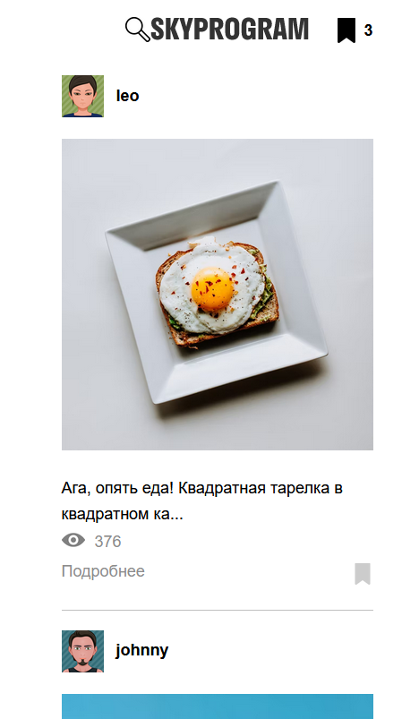
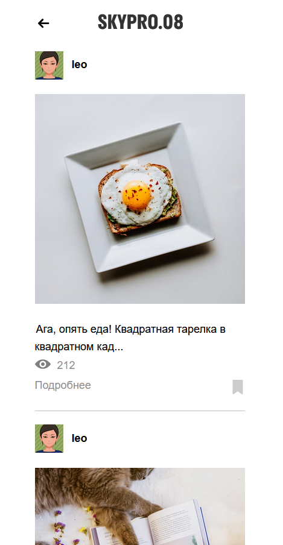
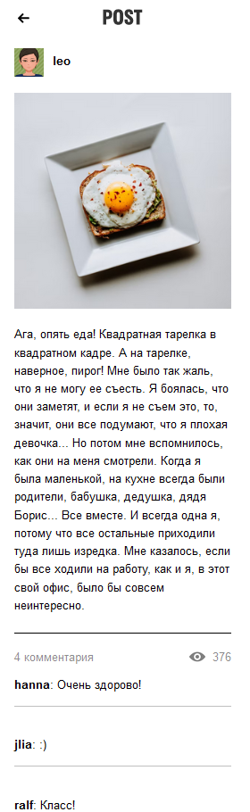
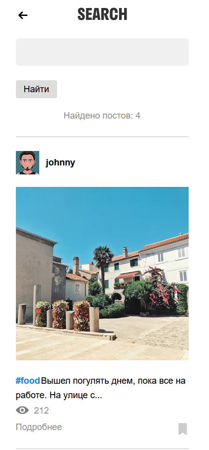

# Курсовая работа №3
___
В этой курсовой наша задача сделать свой мини-инстаграмм.

###Фронт работы
___
#####1.Сделать начальную страницу
На ней отображаются все посты, имена и аватарки пользователей, по ним можно перейти на их "страницы", так же есть поиск по постам.

___
#####2. Сделать гиперссылки: при нажатие на аватарку или никнейм, при нажатие на картинку поста, при нажатие на "Подробнее"
Так выглядит страница выбранного пользователя

___
А так страница с комментариями поста

___
#####3. Сделать поиск по постам

Осуществить переход на страницу поиска и при запросе вывести посты по ключевому слову.

___
#Task List
- [x] Приложение работает
- [x] Все гиперссылки работают
- [x] Работа поиска
- [ ] Добавление/удаление закладок (в следующих обновлениях будет добавлено)
- [ ] Работа с хештегами (в следующих обновлениях будет добавлено)
- [ ] Возможность регистрации (в следующих обновлениях будет добавлено)
- [ ] Возможность добавление собственных постов (в следующих обновлениях будет добавлено)
- [x] Тесты функций
- [x] Тесты API
  - [x] Сохранение логов API